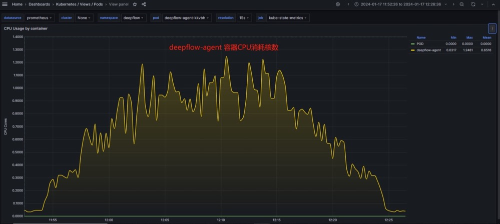

# Deepflow性能压测问题求助

##  1.问题描述
deepflow-agent性能对比测试，实际使用单台物理机部署所有应用包括被测应用程序、redis、mysql、nginx、K8S、deepflow等相关系统，通过开启、关闭deepflow-agent对比应用性能来测试评估deepflow-agent对应用性能的影响。分别测试四个接口，被测试应用将分别调用请求redis、mysql、nginx及混和调用。性能对比情况如下：
1. redis接口：有agent时吞吐量下降10%~14%，响应时间上升10%~19%；
2. mysql接口：有agent时吞吐量下降3%~10%，响应时间上升3%~10%；
3. nginx接口：有agent时吞吐量下降8%~13%，响应时间上升8%~13%；
4. 混合接口： 有agent时吞吐量下降8%左右，响应时间上升8%~12%；
   综述：deepflow-agent启动将影响应用性能在10%左右，同时deepflow-agent每秒包数达到70K左右时存在丢包的现象。

## 2.软件环境

### 2.1 软件版本
- deepflow: v6.3.9
- redi: 7.2.3
- mysql: 8.2.0
- nginx: 1.25.0
- 监控程序: https://github.com/prometheus-operator/kube-prometheus
### 2.2 操作系统
- Linux release 7.9.2009 (Core)
- 内核版本: 5.10.109-1
## 3.硬件环境
- 服务器：DELL R630
- CPU: Intel(R) Xeon(R) CPU E5-2630 v3 @ 2.40GHz
- 内存: 128G

## 4. 压测场景描述

### 4.1 压测工具
- jmeter

### 4.2 压测参数
deepflow-agent: 2G内存，1核CPU

### 4.3 redis压测结果

## 5.问题表现
redis接口：有agent时吞吐量下降10%~14%，响应时间上升10%~19%；

